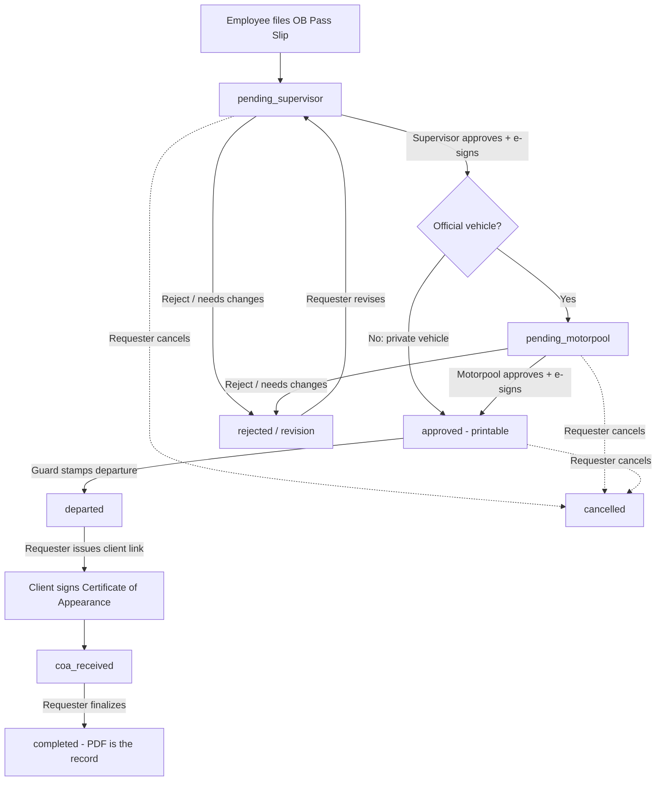
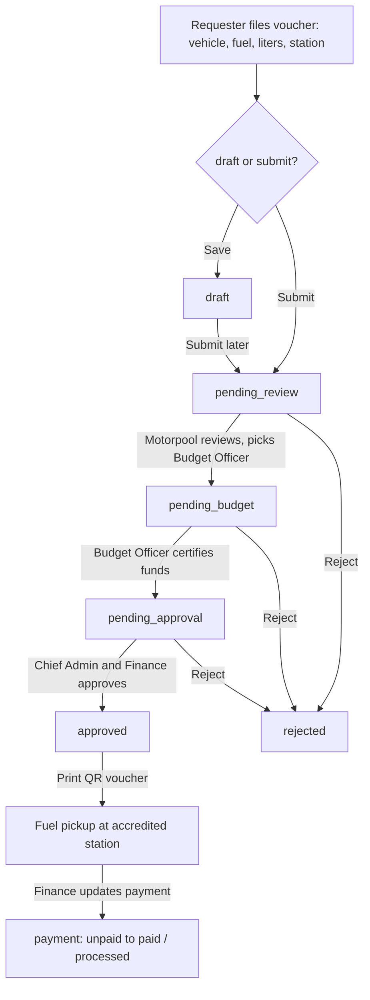
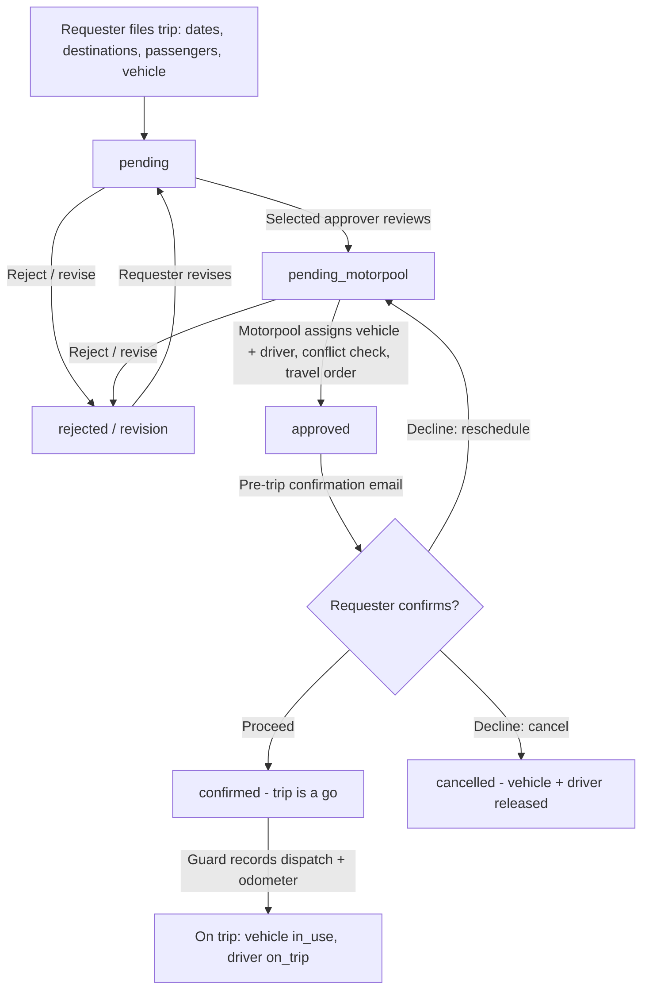
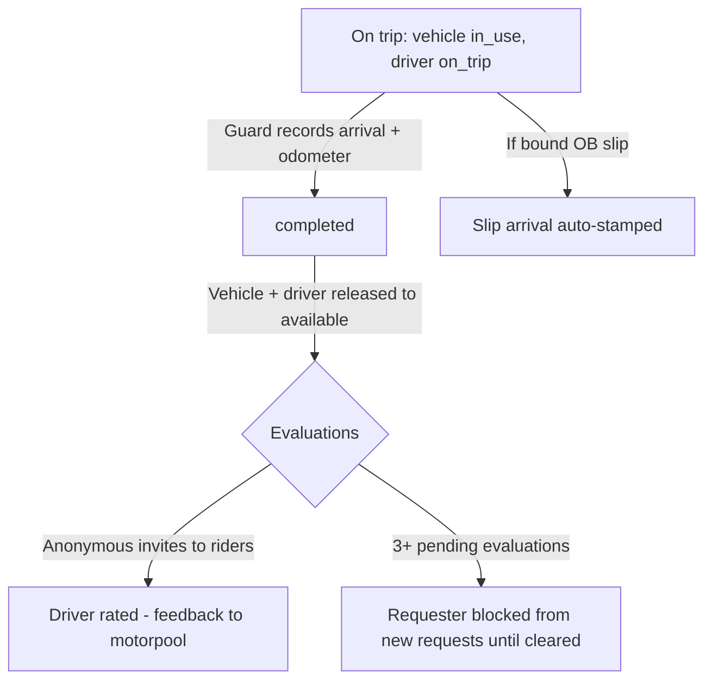
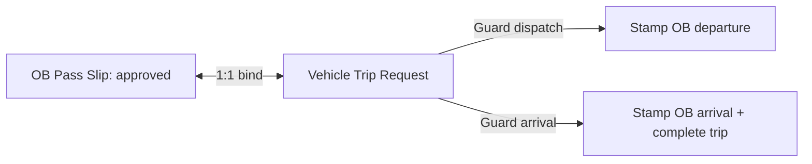

# LOKA Fleet — New Features Showcase

> **Purpose of this file:** source material for generating a slide presentation
> (feed this file to a slide-making AI). Each `##` section is roughly one
> slide; subsections marked **(slide)** deserve their own slide. Mermaid
> diagrams can be rendered as flowchart visuals. Suggested deck: ~14 slides.

---

## (slide) 1. Title — LOKA Fleet Management System

- **LOKA Fleet**: DICT Region 2's internal fleet management system
- Digitizes three paper-heavy processes:
  1. **OB Pass Slip** — Official Business gate pass + Certificate of Appearance
  2. **Gas Voucher** — fuel authorization with 3-gate approval + QR verification
  3. **Vehicle Trip Ticket** — end-to-end trip request, dispatch, return & evaluation
- Cross-cutting upgrades: in-app/email/SMS/Telegram alerts, e-signatures,
  QR verification pages, full audit trails, guard dashboard integration

---

## (slide) 2. Agenda

1. OB Pass Slip workflow
2. Gas Voucher workflow
3. Vehicle Trip Ticket workflow
4. What ties them together (notifications, QR, audit, guard)
5. What's next

---

## (slide) 3. Feature 1 — OB Pass Slip (what it replaces)

- **Before:** paper gate pass for official business trips; manual signatures;
  guard logbook; Certificate of Appearance chased by hand.
- **After:** numbered digital pass slip (`pass_slip_no`, unique), e-signatures
  at every stage, guard stamps departure/arrival at the gate, client signs the
  Certificate of Appearance via a secure token link — all tracked by status.
- **Key idea for the audience:** the slip follows the employee from request,
  to gate, to client, to completed record — nothing gets lost.

---

## (slide) 4. OB Pass Slip — actors & statuses

**Actors (slide table):**

| Actor | Role in the flow |
|---|---|
| Employee (requester) | Files slip, prints it, issues client link, finalizes |
| Immediate Supervisor (`is_ob_approver`) | First approval + e-signature |
| Motorpool Head | Second approval for official-vehicle slips + e-signature |
| Guard on duty | Stamps departure & arrival at the gate |
| Client / COA signatory | Signs Certificate of Appearance via token link (no login needed) |

**Statuses:** `pending_supervisor` → `pending_motorpool` → `approved` →
`departed` → `coa_received` → `completed`, plus `rejected`, `revision`,
`cancelled`.

---

## (slide) 5. OB Pass Slip — flowchart

**Talking points:**
- Private-vehicle slips **skip Motorpool entirely** — supervisor approval
  completes the flow (faster path, same controls).
- Every approval/reject/revision requires **comments on returns** and an
  **e-signature on approvals**.
- Guards get an automatic "slip ready for the gate" bell notification.
- A slip can be **bound 1:1 to a vehicle trip request** — dispatching the
  vehicle auto-stamps the slip's departure; arrival auto-stamps its return.

---

## (slide) 6. Feature 2 — Gas Voucher (what it replaces)

- **Before:** paper fuel vouchers, unclear approval chain, no station control,
  no proof of authenticity at the pump.
- **After:** numbered voucher (`voucher_no`), accredited gas-station dropdown,
  **three approval gates** (Motorpool → Budget → Chief Admin & Finance),
  printable voucher with **QR code verifiable on a public page**, and payment
  tracking (`unpaid` → `paid`/`processed`).
- **Key idea for the audience:** no fuel moves without three pairs of eyes,
  and anyone can verify a printed voucher by scanning it.

---

## (slide) 7. Gas Voucher — actors & gates

**The three gates (slide table):**

| Gate | Status in | Decided by | Decides |
|---|---|---|---|
| 1. Review | `pending_review` | Motorpool Head (or approver/admin) | Picks the Budget Officer, forwards |
| 2. Budget certification | `pending_budget` | Budget Officer / OIC Budget Officer (flagged users only) | Certifies funds, forwards |
| 3. Final approval | `pending_approval` | Chief Admin & Finance | Approves or rejects |

- Requester nominates a preferred Budget Officer at filing time.
- Any gate can **reject** (with reason → requester is notified).
- Requester can save as `draft` first, submit when ready.

---

## (slide) 8. Gas Voucher — flowchart

**Talking points:**
- Printed voucher carries a **QR code** → public verify page proves authenticity
  (no login needed at the pump).
- Each decision fires **notifications** (in-app + email + SMS + Telegram):
  budget pending, budget approved, voucher approved/rejected, payment updated.
- Approvers can correct details mid-flow without resetting the status.

---

## (slide) 9. Feature 3 — Vehicle Trip Ticket (what it replaces)

- **Before:** paper trip tickets, logbook dispatch, phone-call confirmations,
  no-show trips discovered at the gate, no driver feedback loop.
- **After:** online request with booking rules (advance window, 72-h trip cap),
  conflict-checked vehicle/driver assignment, **"GRAB-style" pre-trip
  confirmation email** (Proceed / Don't Proceed), guard dispatch & arrival
  with odometer capture, and **anonymous post-trip driver evaluations**.
- **Key idea for the audience:** from request to evaluation, every trip is
  confirmed, tracked, and rated — no ghost trips.

---

## (slide) 10. Vehicle Trip Ticket — flowchart (request to dispatch)

**Talking points:**
- Booking rules enforced in picker **and** server-side: advance window,
  minimum lead time, max 72-hour duration.
- Motorpool sees **vehicle/driver conflict warnings** before assigning.
- The confirmation email is single-use tokenized — expired or post-dispatch
  confirmations auto-cancel safely.

---

## (slide) 11. Vehicle Trip Ticket — flowchart (return to evaluation)

**Talking points:**
- Arrival flips the request to `completed` and frees the vehicle/driver instantly.
- **Anonymous driver evaluations** close the quality loop; QoS reminders,
  expiry, and a create-block rule keep response rates honest.
- Overdue trips surface on KPIs with re-notification.

---

## (slide) 12. What ties it all together

- **Notifications everywhere:** every approval, rejection, dispatch, arrival,
  and payment event notifies the right people via in-app + email + SMS +
  Telegram (soft-fail, queue-drained — alerts never break the action).
- **E-signatures:** saved per user, resolved at each approval/guard stamp.
- **QR verification:** gas vouchers (and trip/ticket verify pages) prove
  paper printouts are genuine.
- **Guard dashboard:** one place for dispatch, arrival, and OB gate stamps —
  with odometer capture (including broken-odometer handling).
- **Audit trails:** separate approval logs, idempotency tokens against double
  submit, status-transition guards against invalid jumps.
- **Reports & exports:** CSV/PDF per module for admin and COA needs.

---

## (slide) 13. OB ↔ Trip integration (bonus slide)

- An approved OB Pass Slip can be **bound 1:1 to a vehicle trip request**
  (before or after submission, per All Father toggle).
- Guard **dispatch** of the vehicle auto-stamps the slip's departure;
  guard **arrival** auto-stamps the slip's return.
- Result: the employee's gate pass and the vehicle's trip record can never
  disagree — one event updates both.

---

## (slide) 14. Closing — what's next

- Telegram alerts live and proven (multi-user bindings on staging).
- OB Pass Slip, Gas Voucher, Trip Ticket workflows fully digital with guard,
  QR, and evaluation loops.
- Suggested next steps: prod rollout per module, staff onboarding on
  Connect flows (Telegram) and QR verification, stewardship of booking rules
  and evaluation KPIs.
- **Thank you / Q&A.**

---

## Appendix — facts the slide AI should not invent

- System: LOKA Fleet Management System, DICT Region 2 (PHP + SQL backend).
- OB statuses: `pending_supervisor`, `pending_motorpool`, `approved`,
  `departed`, `coa_received`, `completed`, `rejected`, `revision`, `cancelled`.
- Gas statuses: `draft`, `pending_review`, `pending_budget`,
  `pending_approval`, `approved`, `rejected`, `cancelled`; payment:
  `unpaid`, `paid`, `processed`, `cancelled`.
- Trip request statuses: `draft`, `pending`, `pending_motorpool`,
  `approved`, `rejected`, `revision`, `cancelled`, `completed`.
- Messenger alerts are Telegram-only (Viber removed: commercial paywall).
- Do not mention Google Chat/Calendar integration — deferred, not built.
